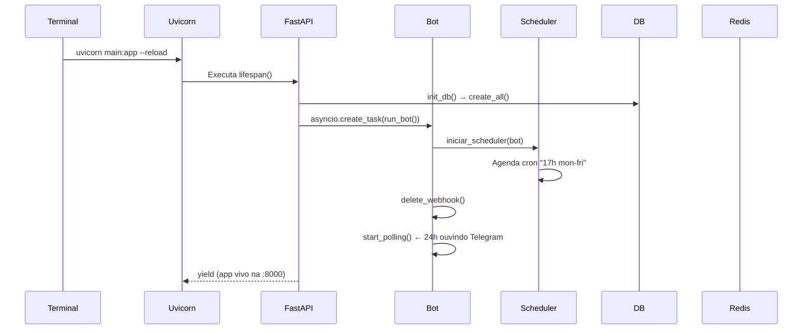

# 🏗️ Orion — Arquitetura do Sistema

## Stack Tecnológica

| Camada | Tecnologia | Função |
|--------|-----------|--------|
| **Servidor** | FastAPI + Uvicorn | Mantém o processo vivo e gerencia o lifespan |
| **Bot** | aiogram 3.x (Dispatcher + Router + FSM) | Interface com usuário via Telegram |
| **Banco Relacional** | PostgreSQL 16 + pgvector | Dados estruturados (itens, reservas, logs) + vetores (RAG) |
| **Cache/Estado** | Redis (alpine) | FSM storage (estados sobrevivem a restart) + memória LLM |
| **Agendador** | APScheduler | Cron jobs: auditoria 17h, alarmes de início/fim |
| **LLM** | Groq API (llama-3.3-70b-versatile) via AsyncOpenAI | NLP e function calling |
| **ORM** | SQLModel (Pydantic + SQLAlchemy) | Validação + banco relacional |
| **Container** | Docker Compose | Infraestrutura (PostgreSQL + Redis) |

---

## Por que cada ferramenta?

### FastAPI + Uvicorn

**Problema:** O bot do Telegram (aiogram) precisa de um loop `asyncio` rodando 24h/dia para escutar mensagens via polling. Um script Python comum (`python main.py`) morre depois de executar.

**Solução:** O FastAPI oferece um **lifespan** (`async with lifespan(app)`) que mantém o processo vivo. O uvicorn é o servidor ASGI que:
- Dispara o `lifespan` (que inicia o bot com `dp.start_polling()`)
- Mantém o processo rodando na porta `:8000`
- Suporta hot-reload (`--reload`) para desenvolvimento
- Gerencia o event loop corretamente

O FastAPI **não é usado como API REST** — é o "motor a diesel" que mantém o bot rodando.

### aiogram 3.x

**Problema:** Precisamos de um framework assíncrono para bots Telegram com suporte a máquinas de estado (FSM), botões inline e modulação por arquivo.

**Solução:** aiogram 3.x fornece:
- `Dispatcher` — roteia mensagens para os handlers corretos
- `Router` — permite modularizar handlers em arquivos separados (`onboarding.py`, `auditoria.py`, etc.)
- `FSMContext` — máquina de estados para fluxos multi-passo (cadastro, auditoria, relatório)
- `CallbackQuery` — botões inline que não poluem o chat
- `MemoryStorage` / `RedisStorage` — persistência de estado

### PostgreSQL + pgvector

**Problema:** O sistema tem relações complexas (1 usuário → N reservas → 1 item) e no futuro precisará de busca semântica.

**Solução:**
- **Relacional:** `Usuario`, `Item`, `Reserva`, `LogUso` — tudo com FKs e tipos específicos (`BigInteger` para `telegram_id`, `UUID` para IDs)
- **pgvector:** Preparado para Sprint 5 (RAG) — busca por similaridade nos procedimentos
- `Enum` do Python mapeado para VARCHAR no banco (impede valores inválidos como "Admim" ou "Menbro")

### Redis

**Problema:** O `FSMContext` padrão do aiogram usa `MemoryStorage` — se o bot reiniciar, todos os estados são perdidos e usuários ficam presos em fluxos incompletos.

**Solução:** Redis como storage externo:
- Estados persistem mesmo com restart do bot
- Performance muito superior ao PostgreSQL para leituras/escritas simples de estado
- Preparado para armazenar memória de conversa do LLM

### APScheduler

**Problema:** A auditoria diária precisa rodar em horário fixo (17h, dias úteis) e alarmes de experimento precisam disparar em datas específicas.

**Solução:**
- `scheduler.add_job(disparar_auditoria_diaria, 'cron', day_of_week='mon-fri', hour=17, minute=0)`
- `scheduler.add_job(notificar_inicio, 'date', run_date=data_inicio)` para alarmes
- `misfire_grace_time=None` — garante que o job não perde a execução

### Groq (LLM via AsyncOpenAI)

**Problema:** O NLP precisa interpretar linguagem natural ("precisa de ácido sulfúrico?") e converter em ações do sistema.

**Solução:** API compatível com OpenAI usando `llama-3.3-70b-versatile` da Groq:
- Function calling para buscar itens, registrar agendamentos, etc.
- Mais barato e rápido que OpenAI para este modelo
- `AsyncOpenAI(api_key=..., base_url="https://api.groq.com/openai/v1")`

### SQLModel / SQLAlchemy

**Problema:** Precisamos de um ORM que valide dados (Pydantic) e opere o banco (SQLAlchemy) simultaneamente.

**Solução:**
- Tabelas são classes Python (`class Item(SQLModel, table=True)`)
- `SQLModel.metadata.create_all(engine)` gera schema automaticamente
- `Session(engine)` gerencia transações com contexto
- Suporte nativo a `BigInteger`, `UUID`, `Enum`, `Relationship`

### Docker Compose

**Problema:** Subir PostgreSQL e Redis manualmente no Windows exige instalação nativa de ambos.

**Solução:** Containerização apenas da infraestrutura:
```bash
docker compose up -d
# PostgreSQL :5432, Redis :6379 — prontos em segundos
```
A aplicação (uvicorn) roda **fora** do container para facilitar desenvolvimento com `--reload`.

---

## 🔄 Fluxo de Inicialização



---

## 📁 Estrutura de Diretórios

```
Orion-py/
├── main.py                  # Entrypoint — FastAPI + lifespan
├── docker-compose.yml       # PostgreSQL + Redis
├── requirements.txt         # Dependências Python
├── planejamento.md           # Roadmap do projeto
│
├── core/
│   └── config.py            # Configurações (variáveis de ambiente)
│
├── database/
│   ├── db.py                # Engine, init_db(), reset_db()
│   └── models.py            # SQLModel: Usuario, Item, Reserva, LogUso, etc.
│
├── bot/
│   ├── handlers/
│   │   ├── onboarding.py    # /start — cadastro do usuário
│   │   ├── handler_estoque.py # Consulta de estoque
│   │   ├── experimento.py   # /hoje — experimento relâmpago
│   │   ├── relatorio.py     # /relatorio — reportar condição
│   │   ├── auditoria.py     # Auditoria diária (17h) — FSM completa
│   │   └── nlp.py           # Rota de linguagem natural (LLM)
│   ├── keyboards.py         # Teclados reutilizáveis
│   └── states.py            # StatesGroups compartilhados
│
├── services/
│   ├── scheduler.py         # APScheduler: crons e alarmes
│   ├── estoque.py           # Lógica de itens (listar, atualizar)
│   ├── log_uso.py           # Registro de logs de auditoria
│   ├── usuario.py           # CRUD de usuários
│   ├── agendamento.py       # Reservas (criar, cancelar, conflitos)
│   ├── llm.py               # Groq + function calling
│   └── rag.py               # (Sprint 5) Busca semântica
│
└── utils/
    ├── importar_excel.py    # Migração da planilha → banco
    ├── importar_csv.py      # (Legado) CSV → banco
    └── test_db.py           # Script de teste do banco
```

---

## 🔑 Conceitos-Chave

### Máquina de Estados (FSM)

Cada handler define um `StatesGroup` com os estados do fluxo. Exemplo da auditoria:

```python
class FSMAuditoria(StatesGroup):
    aguardando_item = State()      # 1. Digitar nome do item
    aguardando_qtd = State()       # 2. Digitar quantidade
    aguardando_estado = State()    # 3. Escolher estado (bom/quebrado)
    aguardando_obs = State()       # 4. Observação (pular/digitar)
    aguardando_continuar = State() # 5. Mais um item? (sim/não)
```

### Segmentação da Auditoria (Grupos A/B/C)

Quando o scheduler dispara a auditoria às 17h, os usuários são divididos:

| Grupo | Critério | Ação |
|-------|----------|------|
| **A** | Reserva **iniciada** (EM_ANDAMENTO/CONCLUIDO) | "Usou algo?" → `uso_sim` / `uso_nao` |
| **B** | Reserva **não iniciada** (AGENDADO) | "Conseguiu realizar?" → `experimento_sim` / `experimento_nao` |
| **C** | Sem reserva no dia | **Silêncio** — não recebe nada |

### Reset do Banco

A função `reset_db()` em `database/db.py`:
1. `DROP SCHEMA public CASCADE` — apaga tudo
2. `CREATE SCHEMA public` — recria
3. `CREATE EXTENSION IF NOT EXISTS vector` — ativa pgvector
4. `SQLModel.metadata.create_all(engine)` — recria tabelas

> ⚠️ O `create_all()` **não altera colunas existentes**. Se adicionar um campo novo num modelo já criado, precisa rodar `reset_db()` ou `ALTER TABLE` manual.

---

## 🚀 Comandos Úteis

```bash
# Infraestrutura
docker compose up -d                    # Sobe PostgreSQL + Redis
docker compose down                     # Para tudo

# Desenvolvimento
uvicorn main:app --reload               # Roda o bot (com reload)

# Reset do banco (uma vez)
# Descomentar reset_db() no main.py → rodar → comentar de volta

# Popular dados
python utils/importar_excel.py          # Lê planilha → banco

# Verificar sintaxe dos arquivos alterados
python -m py_compile services/scheduler.py
python -m py_compile bot/handlers/auditoria.py
```
